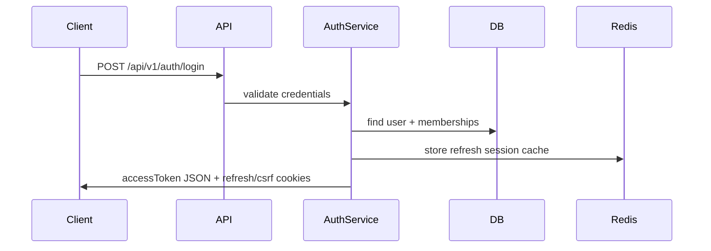
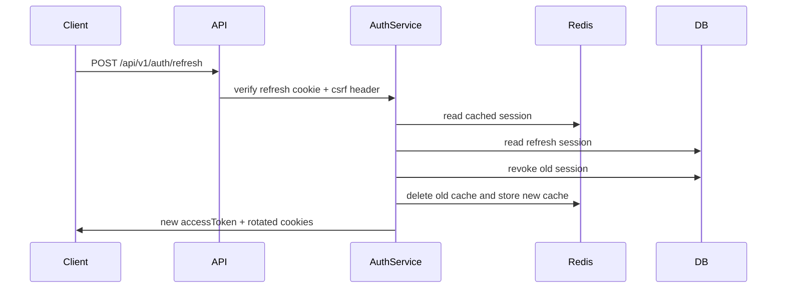

# Authentication Flow

## Table of Contents
- [Overview](#overview)
- [Implemented Flows](#implemented-flows)
- [Cookie and Token Model](#cookie-and-token-model)
- [Flow Diagrams](#flow-diagrams)

## Overview
Authentication is implemented in `backend/src/modules/auth`.

Implemented backend flows:
- signup
- login
- logout
- logout all devices
- refresh token rotation
- workspace switching
- email verification
- resend verification
- forgot password
- reset password
- current-user lookup

## Implemented Flows
### Signup
- Validates `name`, `email`, and `password`
- Creates user with hashed password
- Stores verification token record
- Sends verification email

### Login
- Verifies user credentials
- Rejects unverified users
- Loads memberships
- Chooses the first organization membership as active workspace when available
- Returns access token in JSON
- Writes refresh token and CSRF token cookies

### Refresh token rotation
- Requires refresh cookie and `x-csrf-token`
- Verifies JWT signature and type
- Verifies Redis cache and PostgreSQL refresh session
- Revokes old refresh session
- Creates new refresh session and CSRF token
- Returns only a new access token in the response body

### Workspace switching
- Requires authenticated access token
- Also requires refresh cookie and CSRF token
- Verifies membership in target organization
- Updates refresh session `activeOrganizationId`
- Returns a new access token plus active organization payload

## Cookie and Token Model
- Access token: bearer JWT, returned in response JSON
- Refresh token: HTTP-only cookie scoped to `/api/v1/auth`
- CSRF token: readable cookie scoped to `/api/v1/auth`
- Access-token revocation: Redis blacklist keyed by JWT `jti`
- Refresh-session persistence: PostgreSQL + Redis cache

## Flow Diagrams
### Login

### Refresh rotation

