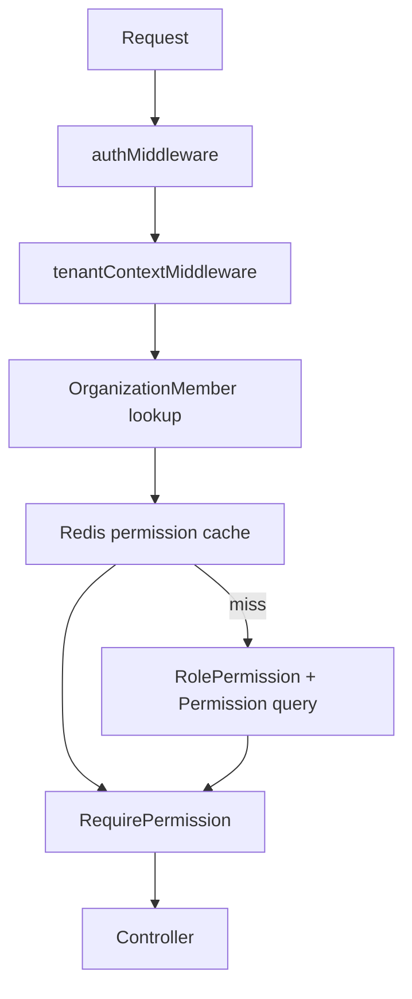

# Authorization Flow

## Table of Contents
- [Overview](#overview)
- [Implemented Controls](#implemented-controls)
- [Permission Resolution](#permission-resolution)
- [Authorization Diagram](#authorization-diagram)

## Overview
Authorization is implemented on the backend through:
- `authMiddleware`
- `tenantContextMiddleware`
- `requireRole`
- `requirePermission`
- tenant-specific role and permission data in Prisma

Frontend authorization is present only as UI gating through `WorkspaceProvider` and `roleFeatureAccess`.

## Implemented Controls
### Backend
- Access token required for protected routes
- Organization context resolved from:
  - `x-organization-id` header
  - route parameter `:id` when allowed
  - token organization as fallback
- Membership lookup enforced against `OrganizationMember`
- Permissions loaded from the member's assigned role
- Protected routes declare exact required permissions

### Frontend
- `WorkspaceProvider` exposes `canAccess(feature)`
- `useRbac(feature)` returns a boolean UI-access signal
- This is client-side presentation gating only

## Permission Resolution
`getCachedMemberPermissions(memberId)`:
1. checks Redis cache
2. falls back to Prisma lookup of `role -> rolePermissions -> permission.name`
3. stores the result in Redis for 5 minutes

## Authorization Diagram

