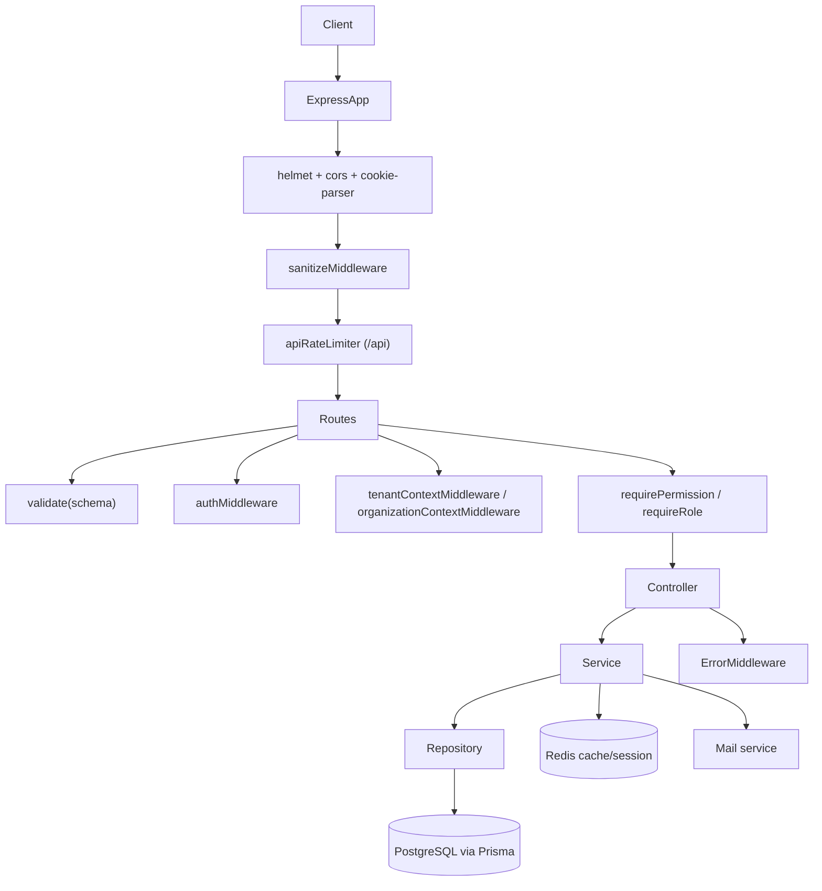

# Backend Architecture

## Table of Contents
- [Overview](#overview)
- [Folder Structure](#folder-structure)
- [Runtime Flow](#runtime-flow)
- [Layering](#layering)
- [Module Boundaries](#module-boundaries)
- [Cross-Cutting Infrastructure](#cross-cutting-infrastructure)

## Overview
The backend is an Express 5 + Prisma + Redis service located in `backend/src`.

Implemented architectural characteristics:
- Modular route/controller/service/repository organization
- Prisma-backed PostgreSQL persistence
- Redis-backed token/session and permission caching
- Zod request validation
- Centralized error handling
- Multi-tenant organization and membership enforcement

## Folder Structure
```text
backend/
├─ src/
│  ├─ app.ts
│  ├─ server.ts
│  ├─ config/
│  ├─ mail/
│  ├─ middleware/
│  ├─ modules/
│  ├─ redis/
│  ├─ shared/
│  ├─ types/
│  └─ utils/
├─ prisma/
│  ├─ schema.prisma
│  └─ migrations/
├─ tests/
└─ dist/
```

## Runtime Flow


## Layering
### Routing layer
- Implemented in `backend/src/modules/*/*.routes.ts`
- Binds HTTP verbs, middleware, validation, and controller actions

### Controller layer
- Implemented in `backend/src/modules/*/*.controller.ts`
- Converts request/response objects to service calls
- Standard response shape is mostly `{ success, data? , message? }`

### Service layer
- Implemented in `backend/src/modules/*/*.service.ts`
- Contains business logic, orchestration, domain validation, side effects, and audit-style operations

### Repository layer
- Implemented in `backend/src/modules/*/*.repository.ts`
- Encapsulates Prisma access patterns

### Middleware layer
- Implemented in `backend/src/middleware/**`
- Covers authentication, tenant resolution, permission checks, request validation, sanitization, rate limiting, and error translation

### Utility layer
- Implemented in `backend/src/utils/**` and `backend/src/shared/**`
- Includes JWT helpers, bcrypt helpers, cookies, logger, async wrapper, pagination, permission caching, slug generation, and audit helpers

## Module Boundaries
Implemented module directories under `backend/src/modules/`:
- `auth`
- `organizations`
- `roles`
- `permissions`
- `invitations`
- `customers`
- `vendors`
- `products`
- `inventory`
- `invoices`
- `payments`
- `expenses`
- `taxes`
- `transactions`
- `reports`

Each business module follows the same boundary pattern:
```text
module/
├─ index.ts
├─ *.routes.ts
├─ *.controller.ts
├─ *.service.ts
├─ *.repository.ts
├─ *.validators.ts
├─ *.types.ts
└─ *.middleware.ts (when needed)
```

## Cross-Cutting Infrastructure
### Configuration
- `config/env.ts` validates runtime environment variables with Zod
- `config/database.ts` creates the Prisma client
- `config/redis.ts` and `redis/redisClient.ts` create the Redis connection
- `config/mail.ts` configures outbound email

### Session and token storage
- Access tokens are JWTs
- Refresh session metadata is persisted in PostgreSQL
- Refresh-token and permission cache entries are stored in Redis

### Generated artifacts
- `backend/dist/` contains compiled output
- Documentation should treat `backend/src/` as authoritative
