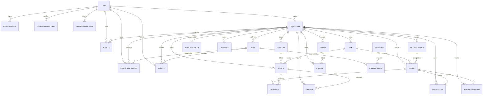

# Database Design

## Table of Contents
- [Overview](#overview)
- [Storage Technologies](#storage-technologies)
- [Domain Areas](#domain-areas)
- [ER Diagram](#er-diagram)
- [Constraints and Indexing](#constraints-and-indexing)

## Overview
The primary database design is defined in `backend/prisma/schema.prisma` and uses PostgreSQL through Prisma.

The application also uses Redis for:
- refresh-session cache
- access-token blacklist
- cached member permissions

## Storage Technologies
- Primary relational store: PostgreSQL
- ORM/client: Prisma
- Secondary cache/session store: Redis

## Domain Areas
Implemented Prisma models cover:
- identity and access: `User`, `RefreshSession`, `EmailVerificationToken`, `PasswordResetToken`
- tenancy and RBAC: `Organization`, `OrganizationMember`, `Role`, `Permission`, `RolePermission`, `Invitation`
- sales/accounting: `Customer`, `Invoice`, `InvoiceItem`, `InvoiceSequence`, `Payment`, `Transaction`
- procurement and catalog: `Vendor`, `ProductCategory`, `Product`, `Tax`
- inventory: `InventoryItem`, `InventoryMovement`
- operational finance: `Expense`
- auditing: `AuditLog`

## ER Diagram

## Constraints and Indexing
Observed implemented patterns:
- strong unique constraints for tenant-specific natural keys such as:
  - `Organization.slug`
  - `Role(organizationId, name)`
  - `ProductCategory(organizationId, name)`
  - `Product(organizationId, sku)`
  - `Invoice(organizationId, invoiceNumber)`
- tenant-first indexes across major business models
- soft-delete timestamps on many business tables via `deletedAt`
- cascade and set-null strategies depending on retention needs
