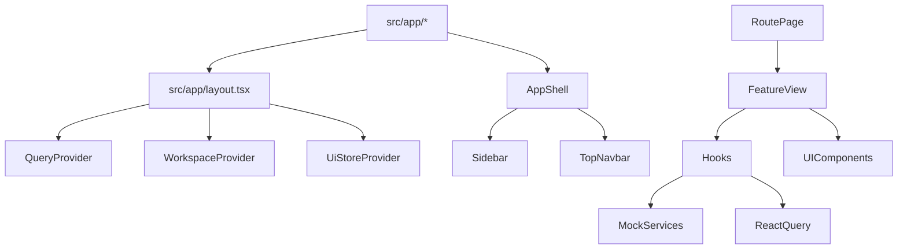

# Frontend Architecture

## Table of Contents
- [Overview](#overview)
- [Folder Structure](#folder-structure)
- [Runtime Composition](#runtime-composition)
- [Application Layers](#application-layers)
- [Feature Organization](#feature-organization)
- [Legacy Code](#legacy-code)

## Overview
The active frontend is a Next.js 15 App Router application under `frontend/src`.

Implemented frontend characteristics:
- App Router route segments under `src/app`
- Feature-oriented screens under `src/features`
- Shared layout and UI primitives under `src/components`
- React Query for async server-state simulation
- Context-based workspace state and UI state
- Mock service layer instead of live HTTP API integration

## Folder Structure
```text
frontend/
├─ src/
│  ├─ app/
│  ├─ components/
│  ├─ config/
│  ├─ constants/
│  ├─ features/
│  ├─ hooks/
│  ├─ lib/
│  ├─ providers/
│  ├─ schemas/
│  ├─ services/
│  ├─ store/
│  ├─ types/
│  └─ utils/
├─ legacy-app/
├─ legacy-components/
└─ package.json
```

## Runtime Composition


## Application Layers
### Routing layer
- Implemented under `src/app`
- Each route page wraps a feature view in `AppShell`
- Loading and error boundaries are implemented per route segment

### Feature layer
- Implemented under `src/features`
- Each feature owns mock data, schemas, hooks, services, types, and feature-specific components

### Shared component layer
- `src/components/layout`: shell, navigation, top bar, command palette, profile/workspace widgets
- `src/components/ui`: buttons, cards, inputs, select, table, badge, avatar, textarea
- `src/components/states`: loading, error, empty-state

### Data layer
- `src/services/mock-api.ts` simulates async responses
- `src/lib/query-keys.ts` centralizes TanStack Query keys
- No implemented HTTP client or interceptor layer exists in `frontend/src`

### State layer
- `src/providers/query-provider.tsx` provides a `QueryClientProvider`
- `src/providers/workspace-provider.tsx` provides workspace/session/RBAC context
- `src/store/ui-store.tsx` provides local UI state for command palette visibility

## Feature Organization
Implemented top-level feature areas:
- `dashboard`
- `customers`
- `vendors`
- `products`
- `inventory`
- `invoices`
- `purchases`
- `transactions`

Each feature generally uses this pattern:
```text
feature/
├─ components/
├─ hooks/
├─ mock-data.ts
├─ schema.ts
├─ service.ts
├─ types.ts
```

## Legacy Code
Status: Implemented but not active in the documented app flow.

The repository also contains:
- `frontend/legacy-app`
- `frontend/legacy-components`

These directories are present, but the documented application routing and shell come from `frontend/src/app`.
