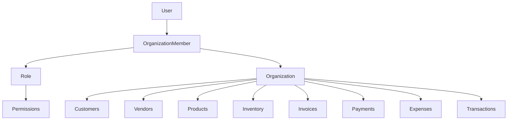

# Tenant Isolation

## Table of Contents
- [Overview](#overview)
- [Isolation Model](#isolation-model)
- [Workspace Switching](#workspace-switching)
- [Isolation Diagram](#isolation-diagram)

## Overview
Tenant isolation is implemented through organization-scoped data models and middleware.

## Isolation Model
### Data layer
Most business tables include `organizationId`, including:
- `Customer`
- `Vendor`
- `ProductCategory`
- `Product`
- `InventoryItem`
- `InventoryMovement`
- `Tax`
- `Invoice`
- `InvoiceSequence`
- `Payment`
- `Expense`
- `Transaction`
- `AuditLog`

### Request layer
Protected tenant-aware routes call `tenantContextMiddleware()`.

This middleware:
- resolves the requested organization
- enforces token workspace restrictions by default
- verifies organization membership
- loads membership and permissions into the request

### Organization-scoped membership
Membership is modeled by `OrganizationMember` with a single assigned `Role`.

## Workspace Switching
Workspace switching is implemented in `POST /api/v1/auth/switch-workspace`.

Behavior:
- verifies refresh token + CSRF token
- validates target membership
- updates `RefreshSession.activeOrganizationId`
- issues a new access token bound to the target organization

## Isolation Diagram

