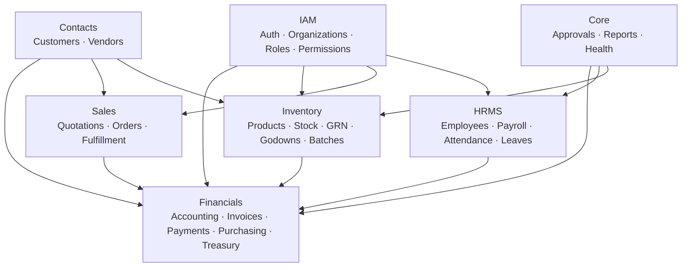
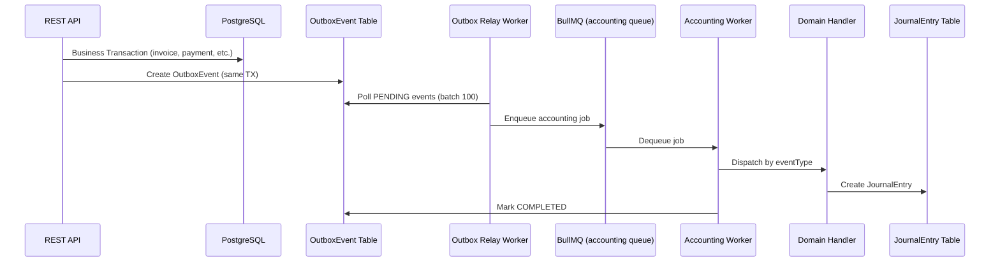

# Repository Map
**Audit Phase 1 — Repository Discovery**
*Generated: 2026-06-17 | Auditor: Principal Architect Review*

---

## Executive Summary

This is a multi-tenant SaaS ERP system built on a TypeScript/Node.js (Express 5) backend with a Next.js frontend, using PostgreSQL via Prisma ORM. The architecture is broadly **domain-driven** with an **event-driven outbox pattern** for async accounting. The codebase is in an active development state — schema artifacts, compilation error logs, and multiple `fix-*.ts` scripts in the repo root indicate iterative bootstrapping rather than a fully stabilized production baseline.

---

## 1. Monorepo Structure

```
erp/                         ← Monorepo root
├── backend/                 ← Express 5 + Prisma API server
├── frontend/                ← Next.js 15 client
├── packages/
│   ├── shared-contracts/    ← Shared TypeScript types
│   └── shared-validation/   ← Shared Zod schemas
├── docs/                    ← Architecture & operational docs
├── .github/                 ← CI/CD workflows
├── docker-compose.observability.yml
├── package.json             ← Workspaces root
└── .env.production / .env.staging
```

**Package Manager**: npm workspaces  
**Node version**: Not pinned (`.nvmrc` not observed)  
**TypeScript**: v6.0.3 (cutting-edge, may cause ecosystem compatibility issues)

---

## 2. Backend Architecture (`d:/erp/backend/src/`)

```
src/
├── app.ts              ← Express app factory (186 LOC, 48 route mounts)
├── server.ts           ← HTTP server + worker bootstrap
├── config/             ← env, logger, redis, database config
├── middleware/         ← auth, tenant, rate-limit, idempotency, sanitize, cache
├── domains/            ← Business domain modules (DDD-aligned)
│   ├── iam/            ← Identity & Access Management
│   │   ├── auth/       ← JWT auth, sessions, CSRF
│   │   ├── organizations/
│   │   ├── roles/
│   │   ├── permissions/
│   │   └── invitations/
│   ├── contacts/       ← Customers & Vendors
│   ├── financials/     ← Core financial engine
│   │   ├── accounting/ ← Chart of Accounts, Journals, Trial Balance
│   │   ├── invoices/   ← AR invoicing
│   │   ├── payments/   ← Customer payments
│   │   ├── expenses/
│   │   ├── taxes/
│   │   ├── treasury/   ← Bank accounts, payment batches
│   │   ├── purchasing/ ← POs, requisitions, RFQs, vendor invoices
│   │   ├── transactions/
│   │   ├── reports/
│   │   ├── credit-notes/
│   │   └── debit-notes/
│   ├── inventory/      ← Inventory management
│   │   ├── products/
│   │   ├── inventory/  ← Stock levels & movements
│   │   ├── grn/        ← Goods Receipt Notes
│   │   ├── godowns/    ← Warehouse locations
│   │   ├── batches/    ← Batch tracking
│   │   ├── serial-numbers/
│   │   ├── stock-groups/
│   │   ├── stock-journals/
│   │   ├── delivery-challans/
│   │   └── stock-verifications/
│   ├── sales/          ← Sales cycle
│   │   ├── quotations/
│   │   ├── orders/
│   │   └── fulfillment/
│   ├── hrms/           ← Human Resource Management
│   │   ├── employees/
│   │   ├── attendance/
│   │   ├── leaves/
│   │   ├── payroll/
│   │   ├── shifts/
│   │   ├── holidays/
│   │   └── claims/
│   └── core/           ← Cross-cutting
│       ├── approvals/
│       ├── reports/
│       ├── health/
│       └── demo/
├── infrastructure/     ← Workflow engine, audit, job processing
│   ├── audit/
│   ├── jobs/
│   ├── number-series/
│   └── workflow/
├── queue/              ← BullMQ workers & job processors
│   ├── worker.service.ts
│   ├── queue.service.ts
│   ├── scheduler.service.ts
│   └── jobs/
│       ├── accounting.job.ts
│       ├── outbox-relay.job.ts
│       ├── mail.job.ts
│       ├── pdf.job.ts
│       ├── report-export.job.ts
│       ├── audit-export.job.ts
│       ├── storage-cleanup.job.ts
│       ├── quotation-expiry.job.ts
│       └── accounting-dlq.job.ts
├── monitoring/         ← OpenTelemetry, Prometheus metrics
│   ├── metrics.ts
│   ├── tracing.ts
│   └── registry.ts
├── shared/             ← Cross-domain utilities
│   ├── domain-events.ts
│   ├── events/event-bus.ts
│   ├── outbox/outbox.service.ts
│   ├── cache/
│   ├── constants/
│   ├── enums/
│   ├── interfaces/
│   └── utils/
├── services/
│   ├── audit/
│   └── notifications/
├── lib/                ← bcrypt, jwt, storage
├── mail/               ← nodemailer email templates
└── utils/              ← ApiError, response helpers
```

### Tech Stack — Backend

| Concern | Technology | Version |
|---|---|---|
| Runtime | Node.js (ESM) | - |
| Framework | Express | 5.2.1 |
| ORM | Prisma | 6.19.3 |
| Database | PostgreSQL | - |
| Queue | BullMQ | 5.78.0 |
| Queue Store | Redis (ioredis) | 5.11.1 |
| Auth | JWT (jsonwebtoken) | 9.0.3 |
| Password | bcrypt | 6.0.0 |
| Logging | pino + pino-http | 9.9.5 |
| Metrics | prom-client | 15.1.3 |
| Tracing | OpenTelemetry (OTLP) | 0.218.0 |
| PDF | pdfkit | 0.18.0 |
| Email | nodemailer | 7.0.6 |
| Storage | AWS S3 SDK v3 | 3.1062.0 |
| Validation | Zod | 4.4.3 |
| TypeScript | TypeScript | 6.0.3 |

---

## 3. Frontend Architecture (`d:/erp/frontend/src/`)

```
src/
├── app/          ← Next.js 15 App Router pages
├── api/          ← API client layer (fetch wrappers)
├── components/   ← Shared UI components
│   └── (shadcn/ui components via components.json)
├── features/     ← Feature-sliced components
├── hooks/        ← Custom React hooks
├── lib/          ← Utility functions
├── providers/    ← React context providers
├── schemas/      ← Zod validation schemas (duplicated from backend)
├── services/     ← Business logic services
├── store/        ← State management (likely Zustand/Redux)
├── types/        ← TypeScript types
├── utils/        ← Frontend utilities
└── constants/    ← App constants
```

### Tech Stack — Frontend

| Concern | Technology |
|---|---|
| Framework | Next.js 15 (App Router) |
| Styling | Tailwind CSS + shadcn/ui |
| Component library | Radix UI (via shadcn) |
| Testing | Cypress (E2E) |
| TypeScript | Yes |

---

## 4. Shared Packages

### `packages/shared-contracts/`
Shared TypeScript types and API contract definitions consumed by both backend and frontend.

### `packages/shared-validation/`
Shared Zod schemas to avoid duplication between client and server validation.

**⚠️ INFERRED**: Despite the existence of these packages, the frontend maintains its own `src/schemas/` directory, suggesting **contract drift** — schemas are being duplicated rather than consistently consumed from the shared package.

---

## 5. Infrastructure Components

| Component | Implementation | Location |
|---|---|---|
| Message Queue | BullMQ on Redis | `backend/src/queue/` |
| Outbox Pattern | Prisma `OutboxEvent` table + relay job | `shared/outbox/`, `queue/jobs/outbox-relay.job.ts` |
| Observability | OTel (Prisma + BullMQ instrumented) | `monitoring/tracing.ts` |
| Metrics | Prometheus (`/metrics` endpoint) | `monitoring/metrics.ts` |
| Cache | Redis (CacheService) | `shared/cache/` |
| Storage | AWS S3 or local filesystem | `lib/storage/` |
| Email | Nodemailer | `mail/` |
| PDF Generation | pdfkit (async via queue) | `queue/jobs/pdf.job.ts` |
| Rate Limiting | express-rate-limit | `middleware/rateLimit.middleware.ts` |
| Idempotency | Redis-backed key store | `middleware/idempotency.middleware.ts` |

---

## 6. Domain Boundaries



---

## 7. Event Architecture Overview



---

## 8. Notable Artifacts in Repository Root

The following non-production files exist in `backend/`:

| File | Purpose | Risk |
|---|---|---|
| `fix-accounting.ts` | One-off schema fix script | **HIGH** — in production repo |
| `fix-accounting2.ts` | Another schema fix | **HIGH** |
| `fix-schema.ts` | Schema mutation script | **HIGH** |
| `append-missing-schema.ts` | Schema append | **HIGH** |
| `update-schema.ts` | Schema update | **HIGH** |
| `update-schema-phase5.ts` | Phased schema update | **HIGH** |
| `tsc_errors.log` (100KB) | TypeScript compilation errors | **MEDIUM** |
| `tsc_errors_new.log` (40KB) | Newer TS errors | **MEDIUM** |
| `invoice_backup.json` (141KB) | **Production data backup** | **CRITICAL** |
| `truncate.ts` | Truncation script | **HIGH** |
| `clean.ts` | Cleanup script | **HIGH** |
| `split_schema_script.cjs` | Schema manipulation | **MEDIUM** |

> **CRITICAL**: `invoice_backup.json` (141KB) appears to contain real invoice data committed directly to the repository. This is a **data breach risk** and must be investigated and purged from git history immediately.

---

## 9. Configuration Management

| Environment | File | Notes |
|---|---|---|
| Development | `backend/.env` | Committed to repo (risk if contains secrets) |
| Local | `backend/.env.local` | |
| Test | `backend/.env.test` | |
| Production | `.env.production` (root + backend) | Should be externalized |
| Staging | `.env.staging` (root) | |

> **ASSUMPTION**: Secrets management uses environment variables. No Vault or AWS Secrets Manager integration observed.

---

## 10. CI/CD

**Location**: `.github/` directory present but not fully reviewed.

**INFERRED**: Standard GitHub Actions pipeline likely handles testing and deployment. Vercel configuration (`frontend/vercel.json`) suggests frontend is deployed to Vercel. Backend deployment method: **UNVERIFIED** (Dockerfile present).

---

## Summary Risk Table

| Area | Status | Risk Level |
|---|---|---|
| Domain separation | Good DDD alignment | LOW |
| Monorepo structure | Well organized | LOW |
| Production data in repo | `invoice_backup.json` committed | CRITICAL |
| Schema fix scripts in repo root | 8+ one-off mutation files | HIGH |
| TypeScript errors | 100KB+ error logs present | HIGH |
| Shared contracts adoption | Schemas duplicated in frontend | MEDIUM |
| Environment management | Multiple `.env` files present | MEDIUM |
