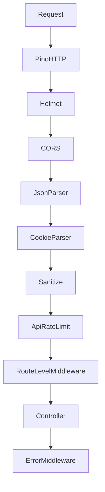

# Backend Middleware

## Table of Contents
- [Execution Order](#execution-order)
- [Implemented Middleware](#implemented-middleware)

## Execution Order

## Implemented Middleware
### Global middleware from `app.ts`
- `pinoHttp`
- `helmet`
- `cors`
- `express.json`
- `express.urlencoded`
- `cookieParser`
- `sanitizeMiddleware`
- `apiRateLimiter` mounted at `/api`
- `errorMiddleware`

### Route-level middleware
- `authMiddleware`
  - validates bearer access token
  - checks Redis blacklist
  - populates `req.user` and `req.auth`
- `tenantContextMiddleware`
  - resolves organization context
  - loads membership and permissions
- `requireRole`
  - checks `req.member.roleName`
- `requirePermission`
  - checks `req.permissions`
- `validate(schema)`
  - validates `body`, `query`, and `params` using Zod
- `requireRefreshToken`
  - checks refresh cookie and CSRF header for refresh/workspace-switch flows

### Sanitization
- trims strings
- removes null bytes
- recursively sanitizes arrays and objects

### Rate limiting
- implemented with `express-rate-limit`
- default window: 15 minutes
- default limit: 100 requests
