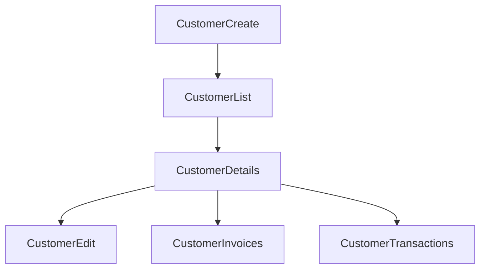

# Customers

## Table of Contents
- [Purpose](#purpose)
- [Backend](#backend)
- [Frontend](#frontend)

## Purpose
The customer module covers master-data records plus customer-ledger visibility.

## Backend
Implemented endpoints:
- `POST /api/v1/customers`
- `GET /api/v1/customers`
- `PATCH /api/v1/customers/:id`
- `DELETE /api/v1/customers/:id`
- `GET /api/v1/customers/:id/ledger`

Entities:
- `Customer`
- `Invoice` (related)

Permissions:
- `customers.create`
- `customers.view`
- `customers.update`

## Frontend
Implemented pages:
- customer list
- customer details
- create customer
- edit customer

Implemented detail panels:
- profile
- invoices
- transactions
- documents
- timeline

Workflow:

