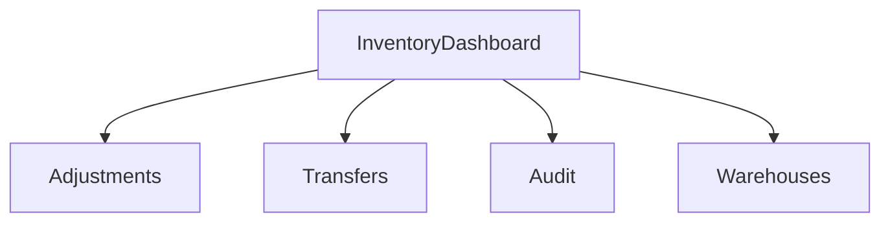

# Inventory

## Table of Contents
- [Backend](#backend)
- [Frontend](#frontend)

## Backend
Implemented inventory entities:
- `InventoryItem`
- `InventoryMovement`

Implemented backend operations:
- `GET /api/v1/inventory/items`
- `GET /api/v1/inventory/movements`
- `POST /api/v1/inventory/adjustments`
- `POST /api/v1/inventory/transfers`

Implemented permission:
- `inventory.manage`

## Frontend
Implemented pages:
- inventory dashboard
- stock adjustments
- stock transfers
- inventory audit
- warehouse management

Implemented supporting UI:
- inventory KPI grid
- inventory table
- inventory module navigation
- adjustment form

Workflow:

