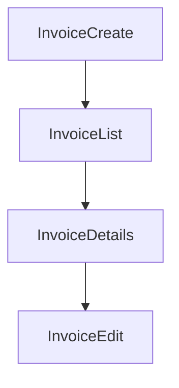

# Invoices

## Table of Contents
- [Backend](#backend)
- [Frontend](#frontend)

## Backend
Implemented entities:
- `Invoice`
- `InvoiceItem`
- `InvoiceSequence`
- `Payment`

Implemented backend endpoints:
- `POST /api/v1/invoices`
- `GET /api/v1/invoices`
- `GET /api/v1/invoices/:id`
- `PATCH /api/v1/invoices/:id`
- `POST /api/v1/payments`
- `GET /api/v1/payments`

Implemented permissions:
- `invoices.create`
- `invoices.view`
- `invoices.update`
- `payments.create`
- `payments.view`

## Frontend
Implemented frontend pages:
- invoice list
- invoice details
- create invoice
- edit invoice

Implemented frontend components:
- invoice editor
- invoice table
- invoice preview
- invoice summary
- invoice line items
- invoice status badge

Workflow:

