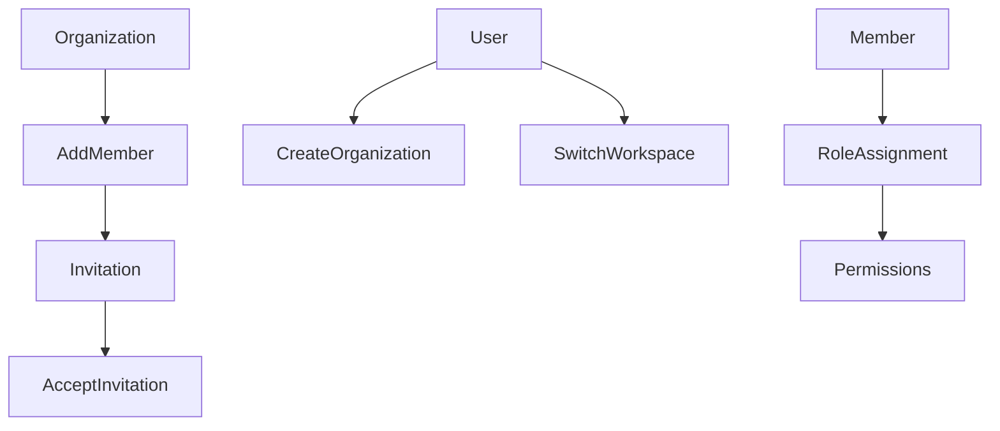

# Organizations

## Table of Contents
- [Purpose](#purpose)
- [Entities](#entities)
- [Implemented Workflows](#implemented-workflows)

## Purpose
Organizations are the multi-tenant boundary for the backend and the mock workspace boundary for the frontend.

## Entities
- `Organization`
- `OrganizationMember`
- `Role`
- `Permission`
- `RolePermission`
- `Invitation`
- `RefreshSession.activeOrganizationId`

## Implemented Workflows

Implemented backend operations:
- create organization
- list organizations
- get/update/delete organization
- list members
- invite member
- update member role
- remove member
- leave organization
- transfer ownership

## Permissions
- `organization.view`
- `organization.update`
- `organization.delete`
- `organization.members`
- `organization.invitations`
- `organization.transfer_ownership`
- `users.delete`

## API Endpoints
- `POST /api/v1/organizations`
- `GET /api/v1/organizations`
- `GET /api/v1/organizations/:id`
- `PATCH /api/v1/organizations/:id`
- `DELETE /api/v1/organizations/:id`
- `GET /api/v1/organizations/:id/members`
- `POST /api/v1/organizations/:id/members/invite`
- `PATCH /api/v1/organizations/:id/members/:memberId`
- `DELETE /api/v1/organizations/:id/members/:memberId`
- `POST /api/v1/organizations/:id/leave`
- `POST /api/v1/organizations/:id/transfer-ownership`
