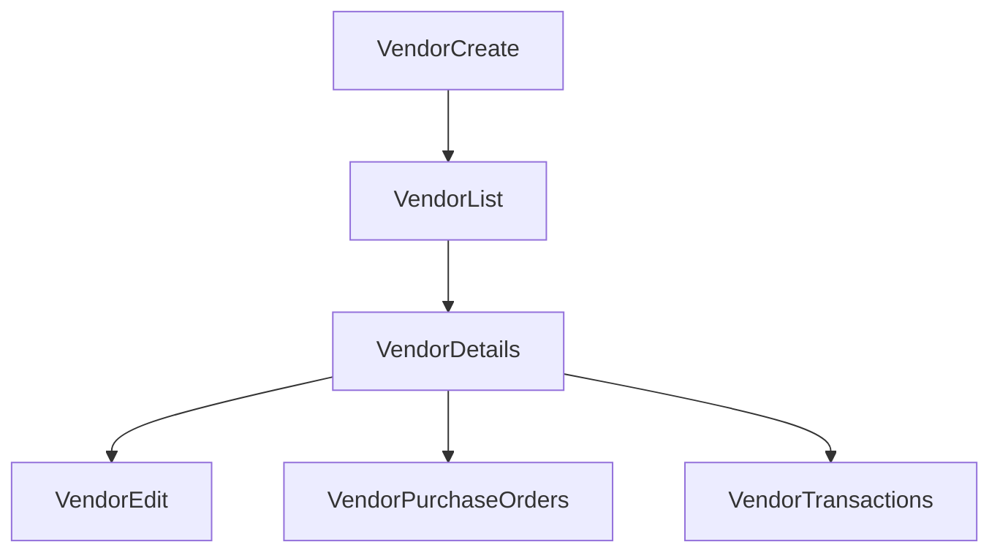

# Vendors

## Table of Contents
- [Purpose](#purpose)
- [Backend](#backend)
- [Frontend](#frontend)

## Purpose
The vendor module covers supplier master data and vendor-ledger visibility.

## Backend
Implemented endpoints:
- `POST /api/v1/vendors`
- `GET /api/v1/vendors`
- `PATCH /api/v1/vendors/:id`
- `DELETE /api/v1/vendors/:id`
- `GET /api/v1/vendors/:id/ledger`

Entities:
- `Vendor`
- `Expense` (related in backend schema)

Permissions:
- `vendors.create`
- `vendors.view`
- `vendors.update`

## Frontend
Implemented pages:
- vendor list
- vendor details
- create vendor
- edit vendor

Implemented detail panels:
- profile
- purchase orders
- transactions
- documents
- timeline

Workflow:

